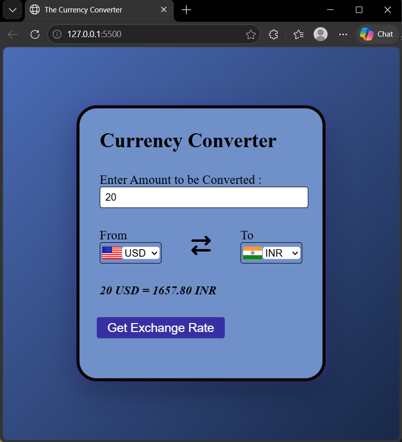
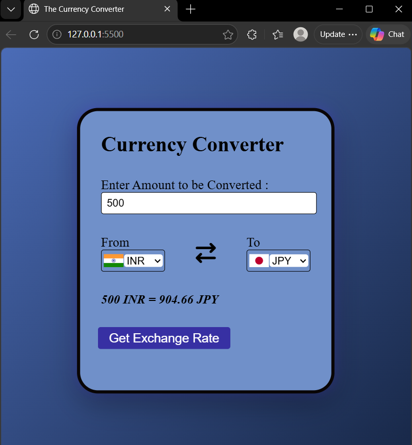

# Currency Converter Web App

A simple and interactive "Currency Converter" built using HTML, CSS, and JavaScript with real-time exchange rates.

## Features
- Convert currencies in real-time
- Dynamic dropdown selection
- Country flag updates
- Accurate rounding of values
- Clean and responsive UI

## Tech Stack
- HTML
- CSS
- JavaScript (Fetch API)

## Preview




## Learnings
- DOM Manipulation
- Async JavaScript (fetch API)
- Working with APIs
- UI design basics

## Project Setup
1. Clone the repo
```bash
git clone https://github.com/TanviVerma-05/CurrencyConverter-webapp.git
```
2. Open 'index.html' in browser
